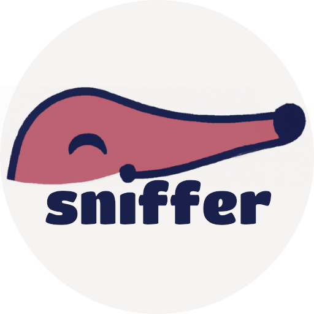

<p align=center margin=20px>

</p>

# **sniffer**
**sniffer** is a toy project framework for safety protocol checking.

## Running
After cloning the repository, **sniffer** can be built and run using the `cargo run --release` command.

## Usage
The executable takes an optional file path argument, which will load up the given `.pif` file.

### Commands
**sniffer** offers a simple REPL which recognizes the following commands:
|  command  | arguments |  action  |
| -- | -- | -- |
|  `query`  |  `<axiom>`  | saturates the rule set, showing a valid derivation leading to the queried atom  if one exists |
|  `define`  |  `<premises> => <conclusion>` or `<axiom>`  | defines a new rule or axiom |
| `remove` | `<premises> => <conclusion>` or `<axiom>` | removes the given rule or axiom if it exists |
| `rules` |  | lists defined rules and axioms |
| `load` | `<file>` | loads a new `.pif` file |
| `dump` | `<file>` | dumps currently defined rules and axioms a `.pif` file |
| `quit` | | mystery command |

### `.pif` files
Those files simply list rules in text form.

Said rules can either be:
- Axioms (`<atom>.`)
- Rules (`<atom> /\ ... /\ <atom> => <atom>.`)

Atoms are formed of constants (in lowercase), which can take zero or more arguments, and variables (in uppercase).

Example:
```
# Oh yeah, comments are allowed too!
# Rules
att(pair(X, Y)) => att(X).
att(pair(X, Y)) => att(Y).

# Axiom
att(leak).
```